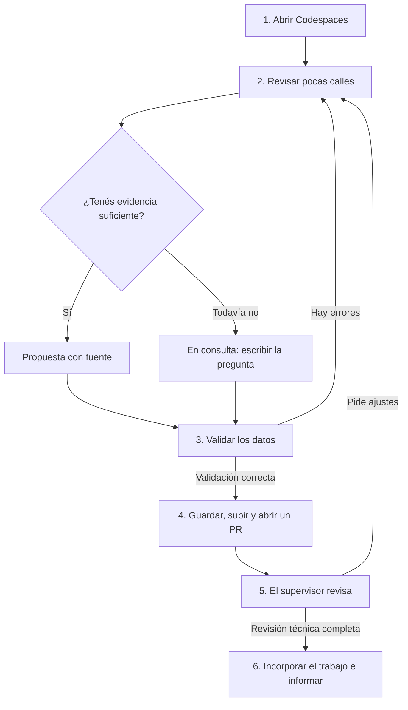

**Dos meses · una hora por día hábil · todo desde el navegador.**

Vas a revisar nombres de calles, encontrar fuentes, explicar dudas y preparar una propuesta para la autoridad municipal. No necesitás saber todo de antemano: aprender a preguntar también es parte del trabajo.

**Primera vez:** abrí el botón, elegí el entorno de 2 núcleos si GitHub lo pregunta y esperá a que termine la preparación automática. Se abren la [guía del estudiante](docs/CODESPACES_ESTUDIANTE.md) y el lote 02. Usá la opción de abrir en el navegador. Solo necesitás tu cuenta GitHub, acceso al repositorio e internet; no hay instalaciones, claves ni configuración local.

**Ya empezaste:** volvé a tu mismo espacio desde [tus Codespaces](https://github.com/codespaces). No crees uno nuevo cada día.

## Dónde trabajamos

**Villa Yacanto · Córdoba · Argentina.** [Abrir la ubicación en Google Maps](https://maps.app.goo.gl/7nQ2W2qGBmtEGNKU6).

El enlace compartido por el coordinador permite conocer la localidad antes de revisar los datos. **Primera exploración:** abrí el mapa, ubicá el pueblo y buscá un nombre que reconozcas del lote 01. Si un nombre difiere, registrá la observación y consultá su fuente; el mapa por sí solo no aprueba una corrección.

[Cómo usamos esta referencia y qué falta verificar en el plano](docs/UBICACION.md).

## Qué vas a hacer

| Tu acción | Lo que aprendés | Lo que dejás |
|---|---|---|
| Revisar 5–10 calles por vez | Leer datos y distinguir evidencia de suposiciones | Nombres con criterio y fuente |
| Registrar una duda | Reconocer qué falta y formular una buena pregunta | Una consulta que la autoridad puede responder |
| Validar el lote | Interpretar mensajes y corregir errores | Un CSV consistente |
| Pedir revisión mediante un PR | Explicar tu trabajo y aprovechar comentarios | Un historial de aprendizaje |

El estudiante gana experiencia demostrable. La municipalidad recibe un inventario y propuestas trazables. El docente puede evaluar el proceso y decidir por separado qué correcciones acepta la institución.

## El camino de una contribución

**Revisión técnica y aprobación municipal son decisiones distintas.** Integrar un PR no aprueba el nombre: el supervisor registra una conformidad municipal específica para que un cambio pueda entrar en el archivo CAD aprobado.

## Tu primera sesión: 60 minutos

1. **10 min:** leé la guía y abrí `datos/lotes/lote-01.csv`, que contiene ejemplos.
2. **15 min:** compará una propuesta con una consulta. Explicá por qué ambas son trabajo útil.
3. **25 min:** con el supervisor, elegí un cambio pequeño de práctica. Creá una rama antes de editar.
4. **10 min:** abrí **Terminal → Run Task → Callejero: Validar datos**, leé el resultado y anotá el siguiente paso.

El lote 01 trae seis ejemplos de conservación de grafía y cuatro preguntas. Es material preparado: no se cuenta como trabajo ya hecho por vos. Una duda sobre a qué Alsina alude la calle debe quedar en consulta; no se resuelve adivinando.

## Las herramientas ya vienen listas

Dentro de Codespaces, abrí **Terminal → Run Task**. También podés buscar **Tasks: Run Task** en la paleta de comandos.

| Tarea del menú | Para qué usarla |
|---|---|
| `Callejero: Validar datos` | Comprobar tus CSV y leer errores |
| `Callejero: Actualizar vista y gráfico` | Crear la imagen de avance en `build/avance.png` |
| `Callejero: Ejecutar pruebas` | Comprobar cambios en las herramientas |
| `Callejero: Generar entrega` | Crear PDF, CSV y archivos de propuesta en una carpeta nueva |
| `Callejero: Regenerar propuesta PDF` | Actualizar el documento institucional con el supervisor |
| `Callejero: Iniciar visor` | Recuperar el visor si se detuvo |

El visor arranca automáticamente. En la pestaña **Ports / Puertos**, abrí **8000 → Open in Browser**. Al guardar un CSV y recargar el visor se vuelve a validar; si hay errores, los muestra y no presenta resultados anteriores como actuales. El puerto es privado por defecto; mantenelo así.

Para guardar cambios, crear una rama y abrir un PR se usa **Source Control / Control de código fuente** en el mismo navegador. [Guía con cada clic y un ejemplo completo](docs/CODESPACES_ESTUDIANTE.md).

## Cómo leer la devolución del PR

Al terminar los controles, un comentario del bot muestra el avance para esa versión. **El círculo naranja señala una fila modificada**; su color interior indica si es propuesta, consulta, conformidad o todavía está sin revisar. Cambiar una fuente también es trabajo visible. Los diez ejemplos del lote 01 forman parte del inventario, pero no cuentan como producción del estudiante.

Si un control falla, el comentario indica cómo abrir el error y corregirlo en la misma rama. El gráfico y los archivos también están en **Actions → ejecución → Artifacts**. [Explicación de las vistas previas](docs/VISTAS_PREVIAS.md).

## Dónde seguir

| Si buscás… | Abrí… |
|---|---|
| Primer acceso, trabajo diario y cierre de sesión | [Guía del estudiante](docs/CODESPACES_ESTUDIANTE.md) |
| Un ejemplo explicado y un pequeño glosario | [Aprender con un caso](docs/APRENDER_CON_UN_CASO.md) |
| Las 40 sesiones del proyecto | [Plan de dos meses](docs/PLAN_40_HORAS.md) |
| Formato de columnas, fuentes y estados | [Cómo contribuir](CONTRIBUIR.md) |
| Las tareas para asignar | [Issues listas para crear](ISSUES.md) |
| Documento para el docente y la autoridad | [Propuesta formal en PDF](propuesta/propuesta_pasantia.pdf) |
| Preparación y comprobación del acceso | [Guía del supervisor](docs/CODESPACES_SUPERVISOR.md) |
| Configurar la publicación del visor | [GitHub y Pages](docs/SUBIR_A_GITHUB.md) |
| Ubicar la localidad | [Villa Yacanto en el mapa](docs/UBICACION.md) |

## Qué sabemos y qué falta confirmar

La base recibida contiene **251 calles y 1.102 rótulos**. Hay 241 registros sin revisar, seis propuestas de ejemplo, cuatro consultas y cero conformidades registradas en la versión inicial. Las 39 calles fuera del recorte anterior siguen incluidas.

La referencia territorial es Villa Yacanto, según el enlace compartido. Aún corresponde confirmar que el plano y su alcance coinciden con esa localidad y verificar su sistema de coordenadas. El visor muestra posiciones del dibujo; el GeoJSON tiene geometrías nulas hasta verificar la georreferenciación. Se trata de puntos de referencia, no ejes de calles. La imagen de bienvenida es una ilustración, no cartografía de la localidad.

El trabajo del estudiante —CSV, código, revisiones, informes y presentación— se realiza íntegramente en Codespaces. La prueba del LISP en una copia del DWG corresponde al operador municipal con AutoCAD; no forma parte de la configuración del estudiante ni bloquea el inicio educativo.

No se incluyen DWG/DXF, imágenes del plano ni geometrías parcelarias. El repositorio es público; los respaldos, firmas y documentos internos quedan en la institución. La licencia MIT cubre el código; ver [NOTICE.md](NOTICE.md) para los datos.
